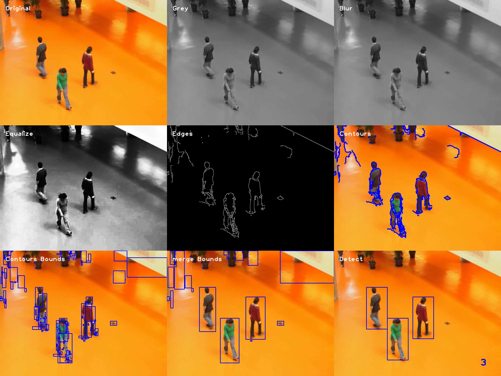

<br />
<div align="center">
  <h3 align="center">SYSC 4102 Pedestrian Detection</h3>

  <p align="center">
    Class project to detect and count the number of pedestrians in an image.
  </p>
</div>


<!-- TABLE OF CONTENTS -->
<details>
  <summary>Table of Contents</summary>
  <ol>
    <li>
      <a href="#about-the-project">About The Project</a>
      <ul>
        <li><a href="#built-with">Built With</a></li>
      </ul>
    </li>
    <li>
      <a href="#getting-started">Getting Started</a>
      <ul>
        <li><a href="#prerequisites">Prerequisites</a></li>
        <li><a href="#installation">Installation</a></li>
      </ul>
    </li>
    <li><a href="#usage">Usage</a></li>
      <ul>
        <li><a href="#usage-prerequisites">Usage Prerequisites</a></li>
        <li><a href="#training">Training</a></li>
        <li><a href="#validation">Validation</a></li>
        <li><a href="#test">Test</a></li>
        <li><a href="#show-steps">Show Steps</a></li>
      </ul>
    <li><a href="#license">License</a></li>
    <li><a href="#contact">Contact</a></li>
    <li><a href="#acknowledgments">Acknowledgments</a></li>
    <li><a href="#references">References</a></li>
  </ol>
</details>


<!-- ABOUT THE PROJECT -->
## About The Project

<p align="center">
  
</p>

This project was created to complete the SYSC 4102 course project. It uses computer vision techniques to determine 
areas of interest and then determine if a pedestrian is in the area of interest. If a pedestrian is there it highlights
them and displays the number of people in the photo.

<p align="right">(<a href="#top">back to top</a>)</p>


### Built With

* [NumPY](https://numpy.org/)
* [OpenCV](https://opencv.org/)
* [scikit-learn](https://scikit-learn.org/stable/)
* [TensorFlow](https://www.tensorflow.org/)

<p align="right">(<a href="#top">back to top</a>)</p>


<!-- GETTING STARTED -->
## Getting Started

This is an example of how you may give instructions on setting up your project locally.
To get a local copy up and running follow these simple example steps.

### Prerequisites

* Python: version 3.10 or higher
* Pip
  ```sh
  python -m pip install --upgrade pip
  ```

### Installation

1. Clone the repo
   ```sh
   git clone git@github.com:ttrautrim/sysc_4102_pedestrian_detection.git
   ```
2. Navigate into the repository
   ```sh
   cd sysc_4102_pedestrian_detection
   ```
3. Install the required packages
   ```sh
   pip install -r requirements.txt
   ```
4. Create the required directories
   ```sh
   mkdir annotations; mkdir images; mkdir test_images
   ```
<p align="right">(<a href="#top">back to top</a>)</p>


<!-- USAGE EXAMPLES -->
## Usage

### Usage Prerequisites

1. Download the Atruim frames and Annotations from [Urban Tracker](https://www.jpjodoin.com/urbantracker/dataset.html) [1]
2. Extract the frames to the **images** folder
3. Extract the Annotations to the **annotations** folder.
   1. They must be in a csv format with no heading and the columns [frame, x_top_left, y_top_left, x_bottom_right, y_bottom_right]


### Training 

1. Navigate to the project root
2. Run the program
    ```sh
    python main.py train
    ```
<p align="right">(<a href="#top">back to top</a>)</p>

### Validation

1. Navigate to the project root
2. Run the program
    ```sh
    python main.py validate
    ```
   
<p align="right">(<a href="#top">back to top</a>)</p>

### Test

1. Copy some images to test from **images** to **test_images**
2. Navigate to the project root
3. Run the program
    ```sh
    python main.py test
    ```
   
<p align="right">(<a href="#top">back to top</a>)</p>

### Show Steps

1. Navigate to the project root
2. Run the program
    ```sh
    python main.py show_steps
    ```
   
<p align="right">(<a href="#top">back to top</a>)</p>


<!-- LICENSE -->
## License

Distributed under the GPL3 License. See `LICENSE` for more information.

<p align="right">(<a href="#top">back to top</a>)</p>


<!-- CONTACT -->
## Contact

Tanner Trautrim - trautrim.tbt@outlook.com

Project Link: [https://github.com/ttrautrim/sysc_4102_pedestrian_detection](https://github.com/ttrautrim/sysc_4102_pedestrian_detection)

<p align="right">(<a href="#top">back to top</a>)</p>


<!-- ACKNOWLEDGMENTS -->
## Acknowledgments

* [Urban Tracker](https://www.jpjodoin.com/urbantracker/dataset.html) [1]

<p align="right">(<a href="#top">back to top</a>)</p>

## References

[1] Jodoin, J.-P., Bilodeau, G.-A., Saunier, N., Urban Tracker: Multiple Object Tracking in Urban Mixed Traffic, Accepted for IEEE Winter conference on Applications of Computer Vision (WACV14), Steamboat Springs, Colorado, USA, March 24-26, 2014


<p align="right">(<a href="#top">back to top</a>)</p>
